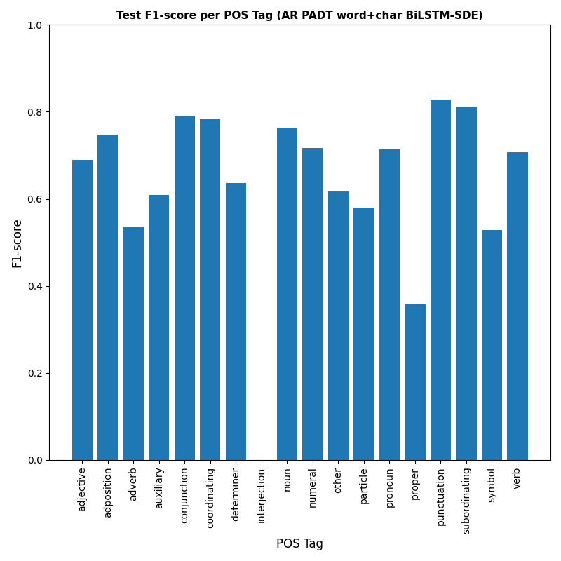
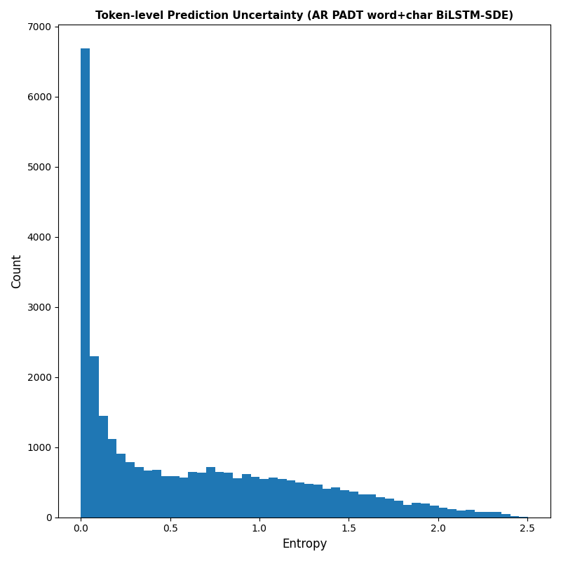
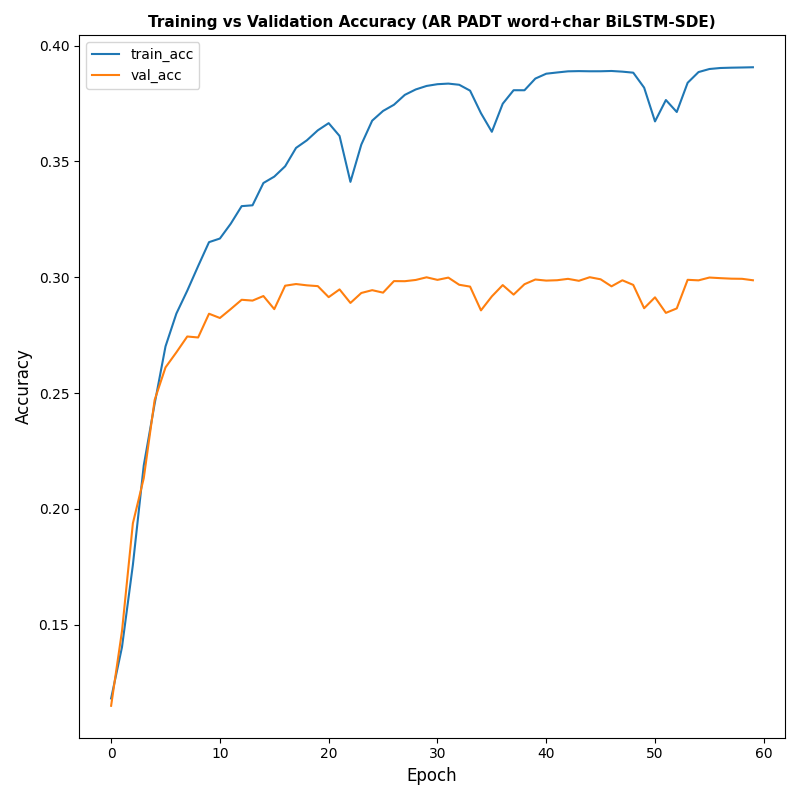

# Stochastic CNN–SDE Model for Robust Character-level Arabic POS Tagging

This repository contains the implementation and experiments for the paper:

**Stochastic CNN–SDE Model for Robust Character-level Arabic POS Tagging**  
to appear in **ICASA’2026 – The First International Conference on Statistics and Its Applications**,  
Djillali Liabes University, Algeria, April 08–09, 2026.  
Conference website: https://www.univ-sba.dz

## Overview

We propose a character-level method for Arabic part-of-speech (POS) tagging that combines a lightweight Transformer encoder with a continuous-time stochastic differential equation (CNN–SDE) layer. The model operates on characters via an embedding layer, applies a Transformer encoder to capture contextual dependencies, and then uses a CNN–SDE layer whose drift and diffusion terms are parametrized by neural networks trained end-to-end.

Using a large annotated Arabic corpus, the Transformer–CNN–SDE model achieves high accuracy and strong macro-F1, outperforming or matching strong baselines such as BERT, BiLSTM, and CRF under comparable experimental conditions. We provide a detailed evaluation including robustness across multiple random seeds, per-class metrics, and visual analyses of the learned stochastic dynamics, showing the benefits of combining character-level representations with stochastic modeling to handle the morphological richness and ambiguity of Arabic.

## Test Set POS Tag Performance

| Label               | Precision | Recall | F1-score |
|---------------------|-----------|--------|----------|
| PAD                 | 0.00      | 0.00   | 0.00     |
| adjective           | 0.47      | 0.44   | 0.46     |
| adposition          | 0.57      | 0.58   | 0.57     |
| adverb              | 0.71      | 0.67   | 0.69     |
| auxiliaryverb       | 0.67      | 0.64   | 0.65     |
| coordinatingconj    | 0.70      | 0.65   | 0.68     |
| determiner          | 0.66      | 0.68   | 0.67     |
| foreignw            | 0.57      | 0.55   | 0.56     |
| interjection        | 0.82      | 0.43   | 0.56     |
| noun                | 0.71      | 0.73   | 0.72     |
| numeral             | 0.63      | 0.61   | 0.62     |
| particle            | 0.51      | 0.14   | 0.22     |
| pronoun             | 0.82      | 0.79   | 0.80     |
| propenoun           | 0.64      | 0.60   | 0.62     |
| punctuation         | 0.00      | 0.00   | 0.00     |
| subordinatingconj   | 0.52      | 0.28   | 0.37     |
| verb                | 0.68      | 0.72   | 0.70     |

Overall metrics:

- **Accuracy**: 0.69  
- **Macro F1**: 0.60  
- **Weighted F1**: 0.52

  

  

  

  

  

## Citation

> Dhayaeddine Messaoudi,  
> “Stochastic CNN–SDE Model for Robust Character-level Arabic POS Tagging,”  
> ICASA’2026 – The First International Conference on Statistics and Its Applications,  
> Djillali Liabes University, Algeria, April 08–09, 2026.

## Contact

- **Author**: Dhayaeddine Messaoudi  
- **Affiliation**: ICOSI Laboratory, Abbes Laghrour University, Khenchela, Algeria  
- **Email**: messaoudi.dhayaeddine@univ-khenchela.dz
